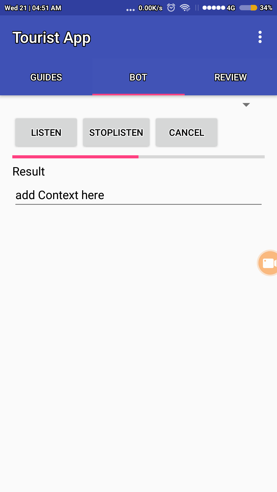

# The-Tourist - Android App 

The Tourist is an app which will enhance the quality experience of audio tour by
providing some awesome features in audio tour which has not been implemented yet.

## About
So we visited the City palace and Hawa mahal on 19th March and [asked](https://drive.google.com/file/d/0B2hkmn0q0Nd5ZEpfOURZbFEyMENZamFsRUdYOWJoMVJzVTB3/view?usp=sharing) many visitors how to improve the experience of tourism
and audio tour. We found out that audio tour methdology which we are using today is outdated and [old](https://github.com/kaus2595/The-Tourist/blob/master/images/IMG_20180319_124158027.jpg) with no control 
of navigation where should tourist go or should head to, also in audio tour, tourist is bound not to ask questions.

## Features
The android app lets you:
- give full real-time naviagtion on map with markers(intrest points) of place you visit.
- lets you ask question about place with a voice based chatbot.
- gives audio tour of your favorite monuments place.
- user can review a place after tour which we can improve.

There are again lots of features which we will add in future:
- support for multi-languages like French, German, etc.
- tickets online with app.
- enhance the chatbot with A.I so it can answer more smartly and intelligently.
- and we will also review the the feedback.

## Screenshots
### user

    

### admin

